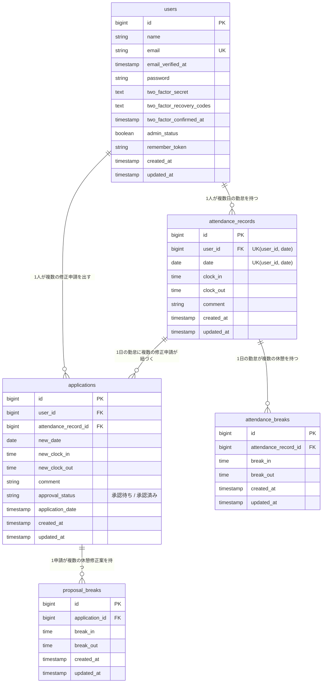

# coachtech 勤怠管理アプリ

## 概要

一般ユーザーが出勤・休憩・退勤の打刻、勤怠の確認、勤怠修正申請を行い、管理者ユーザーが全ユーザーの勤怠確認・スタッフ管理・修正申請の承認を行う、勤怠管理を目的とした Web アプリケーションです。

## 使用技術

- PHP 8.2
- Laravel 10.x
- MySQL 8.4
- Laravel Sail（Docker）
- Laravel Fortify（認証）
- Laravel Sanctum（公開API認証）

## 環境構築手順

1. リポジトリを取得する

```bash
   git clone <このリポジトリのURL>
   cd <プロジェクトディレクトリ>
```

2. `.env.example` を `.env` にコピーする

```bash
   cp .env.example .env
```

3. 依存パッケージをインストールする（clone 直後は `vendor/` が無く sail を実行できないため、Docker で composer を実行する）

```bash
   docker run --rm \
     -u "$(id -u):$(id -g)" \
     -v "$(pwd):/var/www/html" -w /var/www/html \
     -e COMPOSER_CACHE_DIR=/tmp/composer_cache \
     laravelsail/php82-composer:latest \
     composer install --ignore-platform-reqs
```

4. Sail を起動し、アプリケーションキーを生成する

```bash
   ./vendor/bin/sail up -d
   ./vendor/bin/sail artisan key:generate
```

5. マイグレーション・シーディングを実行する

```bash
   ./vendor/bin/sail artisan migrate --seed
```

6. フロントエンドをビルドする

```bash
   ./vendor/bin/sail npm install
   ./vendor/bin/sail npm run dev
```

7. アクセスする
    - アプリ: http://localhost
    - phpMyAdmin: http://localhost:8080
    - Mailpit: http://localhost:8025

## ログイン情報（シーディングで自動作成）

| 役割           | メールアドレス    | パスワード | 備考                |
| -------------- | ----------------- | ---------- | ------------------- |
| 一般ユーザー   | user1@example.com | password   | メール認証済み      |
| 一般ユーザー   | user2@example.com | password   | メール認証済み      |
| 管理者ユーザー | user3@example.com | password   | admin_status = true |

- 一般ユーザーログイン: http://localhost/login
- 管理者ログイン: http://localhost/admin/login
- user1 には、マイ勤怠レポート（`/attendance/report`）の確認用データ（過去5ヶ月＋当月17日）が入っています。当月分は件数を揃えるため、当日以降の日付も含みます（当日は打刻確認のため除外）。

## 主な機能

### 一般ユーザー

- 会員登録・ログイン・ログアウト
- 出勤・休憩・退勤の打刻（`/attendance`）
- 勤怠一覧の確認（`/attendance/list`）
- 勤怠詳細の確認・修正申請（`/attendance/{id}`）
- 修正申請一覧の確認（`/stamp_correction_request/list`）
- メール認証（Mailpit: http://localhost:8025）
- マイ勤怠レポート（`/attendance/report`）

### 管理者ユーザー

- 管理者ログイン・ログアウト（`/admin/login`）
- 全ユーザーの当日勤怠一覧（`/admin/attendance/list`）
- 勤怠詳細の確認・直接修正（`/attendance/{id}`）
- スタッフ一覧（`/admin/staff/list`）
- スタッフ別の月次勤怠一覧（`/admin/attendance/staff/{id}`）
- 修正申請一覧の確認・承認（`/stamp_correction_request/list`, `/stamp_correction_request/approve/{id}`）
- スタッフ別月次勤怠の CSV 出力

### 公開API（`/api/v1/attendance-records`）

| メソッド  | URI                                           | 認証                       |
| --------- | --------------------------------------------- | -------------------------- |
| GET       | /api/v1/attendance-records                    | 不要                       |
| GET       | /api/v1/attendance-records/{attendanceRecord} | 不要                       |
| POST      | /api/v1/attendance-records                    | Sanctum（Bearer トークン） |
| PUT/PATCH | /api/v1/attendance-records/{attendanceRecord} | Sanctum＋本人または管理者  |
| DELETE    | /api/v1/attendance-records/{attendanceRecord} | Sanctum＋本人または管理者  |

## テストの実行

```bash
./vendor/bin/sail artisan test
```

## コード整形（Laravel Pint）

```bash
./vendor/bin/sail pint
```

## ER図



### テーブル概要

| テーブル             | 説明                                                                     |
| -------------------- | ------------------------------------------------------------------------ |
| `users`              | 一般ユーザー・管理者ユーザー（`admin_status` で区別）                    |
| `attendance_records` | 1日1件の勤怠（出勤・退勤・備考）。`user_id` と `date` の組み合わせで一意 |
| `attendance_breaks`  | 勤怠に紐づく休憩（1日に複数回可）                                        |
| `applications`       | 勤怠の修正申請。承認前は「承認待ち」、承認後は「承認済み」               |
| `proposal_breaks`    | 修正申請に紐づく休憩の修正案                                             |

## ディレクトリ構成の補足

- `app/Http/Controllers/AttendanceRecordController.php` : 打刻・勤怠一覧・勤怠詳細表示・修正（申請/直接）を担当。一般ユーザー・管理者共通で使用
- `app/Http/Controllers/ApplicationController.php` : 修正申請の一覧・承認を担当。一般ユーザー・管理者共通で使用
- `app/Http/Controllers/Admin/AdminAuthController.php` : 管理者ログイン画面の表示（ログイン・ログアウト処理は Fortify）
- `app/Http/Controllers/Admin/AdminAttendanceController.php` : 管理者向け・全ユーザーの当日勤怠一覧
- `app/Http/Controllers/Admin/StaffController.php` : スタッフ一覧・スタッフ別月次勤怠一覧
- `app/Actions/Fortify/CreateNewUser.php` : 会員登録処理（`RegisterRequest` のルールを使用）
- `app/Providers/FortifyServiceProvider.php` : ログイン処理のカスタマイズ（`/admin/login` は管理者、`/login` は一般ユーザーのみ認証）
- `lang/ja/auth.php`, `lang/ja/validation.php` : 日本語バリデーション・認証メッセージ
